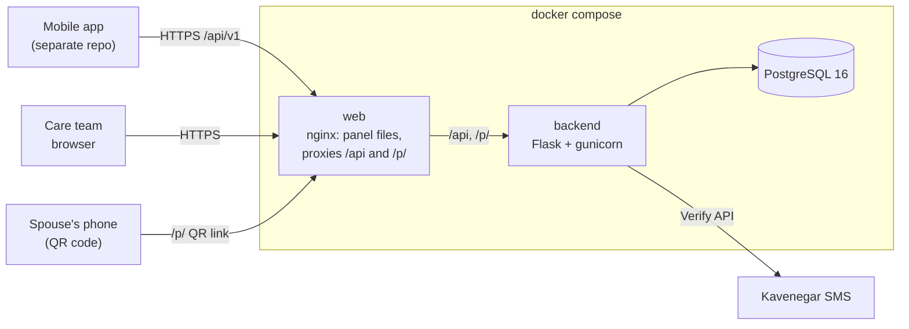

# Madare Emrooz (مادر امروز)

Backend API, staff web panel and mothers' web app for **Madare Emrooz**, a maternal and child health
platform. Mothers keep their health record, follow their pregnancy and report warning signs, in the
mobile app (developed in a separate repository) or in the mothers' web app here. Midwives, doctors and
admins use the web panel in this repository to look after them.

This repository contains:

| Folder | What it is | Stack |
|---|---|---|
| [`backend/`](backend/README.md) | The API used by the mobile app and the web panel | Python 3.12, Flask, PostgreSQL 16 |
| [`web-panel/`](web-panel/README.md) | The care team's web panel, in Persian and English | Vue 3, TypeScript, Vite, daisyUI |
| [`mother-app/`](mother-app/README.md) | The mothers' web app, in Persian, built for phones | Vue 3, TypeScript, Vite, daisyUI |
| `docker-compose.yml` | The whole system: database, API and web panel | Docker Compose |

---

## Contents

1. [What Phase 1 does](#what-phase-1-does)
2. [Architecture](#architecture)
3. [Quick start with Docker](#quick-start-with-docker)
4. [Configuration](#configuration)
5. [Development without Docker](#development-without-docker)
6. [Tests](#tests)
7. [API](#api)
8. [Roles and access](#roles-and-access)
9. [Operations](#operations)
10. [Security and privacy](#security-and-privacy)
11. [Troubleshooting](#troubleshooting)
12. [Documentation](#documentation)
13. [Contributing](#contributing)

---

## What Phase 1 does

Phase 1 (the MVP) covers sign-in, the health record, the pregnancy, fitness and rehabilitation paths,
daily monitoring, medical documents and the care team panel. AI, booking, payments and advanced triage
come in later phases.

**For mothers (through the mobile app's API)**

- **Sign-in:** an SMS code (OTP) sent through Kavenegar; a new number creates an account.
- **Onboarding:** choose a goal (pregnancy, fitness or rehabilitation), then fill in the profile
  (including both blood types) and the medical and midwifery history. The API tells the app which
  home screen to open: pregnancy, trying to conceive, postpartum, fitness or rehabilitation.
- **Pregnancy:** the due date is calculated from the last period. The current week is always
  up to date, and she can correct her details later.
- **Bleeding reports:** a bleeding report raises a **red alert** for her midwife, or for the admins
  while she hasn't chosen one.
- **Her midwife:** she chooses her own midwife from the list the admins publish.
- **Fitness and rehabilitation:** the fitness dashboard opens after a specialist visit. Advanced
  rehabilitation exercises stay locked until the visit and a doctor's approval.
- **Partner QR code:** her spouse scans it to see the pregnancy week and due date, without an account.

**For the care team (web panel)**

- **Midwife:**
  - a red alert inbox;
  - her own mothers, with search;
  - each mother's full record;
  - recording vitals and symptoms;
  - uploading and removing documents;
  - correcting the due date;
  - notes and risk flags.
- **Doctor:**
  - every mother (Phase 1);
  - the same record;
  - approving or revoking the rehabilitation plan.
- **Admin:** staff accounts and alerts from mothers with no midwife yet.
- **Audit log:** every view, change, refusal, upload and alert is recorded.

---

## Architecture



- **The backend** is a modular monolith: one Flask app and one database, split into modules that
  follow the product spec.
  - The modules are identity, profiles, pregnancy, monitoring, documents, care_team, audit,
    fitness and rehabilitation.
  - Each module is layered (domain → application → infrastructure → api), so medical rules are plain
    Python that's easy to test.
  - A test enforces the dependency rules. See [`backend/docs/architecture.md`](backend/docs/architecture.md).
- **The web panel** is a static single-page app. In Docker, nginx serves it and forwards `/api/`
  and `/p/` to the backend, so browser and API share one origin and no CORS setup is needed.
- **Medical documents** (JPEG, PNG or PDF, up to 10 MB) are stored in PostgreSQL, so the database
  backup includes them.

---

## Quick start with Docker

Requires Docker with Compose v2.

```bash
git clone https://github.com/humphreywambuz/madare-emrooz.git
cd madare-emrooz

cp .env.example .env
# Edit .env: set POSTGRES_PASSWORD, and SECRET_KEY to a random value:
python3 -c "import secrets; print(secrets.token_urlsafe(48))"

docker compose up -d --build        # first build takes a few minutes
docker compose ps                   # wait until all three services are "healthy"
```

The database schema is created automatically on start (migrations run in the backend container).

Create the first admin, then open the panel:

```bash
docker compose exec backend flask create-admin 09121234567 --first-name Ali --last-name Ahmadi
```

1. Open <http://localhost:8080> and sign in with that mobile number.
2. With the default `SMS_BACKEND=console`, no SMS is sent. Read the code from the log:
   `docker compose logs backend | grep "SMS"`.
3. As the admin, create the midwives and doctors under **Staff**. They sign in the same way.

The API is at <http://localhost:8080/api/v1> (health check: `/api/v1/health`).

The mothers' app is at <http://localhost:8081>. Any mobile number that is not a staff account signs in
as a mother; a new number creates her account. Read the code from the log the same way.

Useful commands:

```bash
docker compose logs -f backend                         # API logs (and console SMS codes)
docker compose exec db psql -U madare madare_emrooz    # database shell
docker compose down                                    # stop (data is kept in the db-data volume)
docker compose down -v                                 # stop and DELETE all data
docker compose up -d --build                           # after pulling new code
```

---

## Configuration

Docker Compose reads `.env` next to `docker-compose.yml` (see [`.env.example`](.env.example)).
Never commit `.env`.

| Setting | Default | Meaning |
|---|---|---|
| `POSTGRES_PASSWORD` | — (required) | Database password. |
| `POSTGRES_DB`, `POSTGRES_USER` | `madare_emrooz`, `madare` | Database name and user. |
| `SECRET_KEY` | — (required) | Signs access tokens, SMS-code hashes and partner QR links. 32+ random characters. Changing it signs everyone out and invalidates partner QR codes. |
| `SMS_BACKEND` | `console` | `kavenegar` sends real SMS. `console` writes the code to the log, for testing only. |
| `KAVENEGAR_API_KEY` | — | Required with `SMS_BACKEND=kavenegar`. |
| `KAVENEGAR_OTP_TEMPLATE` | `madareemrooz-otp` | Kavenegar Verify template name. Its text contains `%token`. |
| `PUBLIC_BASE_URL` | the request's host | Public address used in partner QR links, e.g. `https://madaremrooz.ir`. |
| `DOCTOR_PATIENT_SCOPE` | `all` | `all` in Phase 1: doctors see every mother. `assigned` in Phase 2: only the mothers who chose them. |
| `TRUSTED_PROXY_COUNT` | `1` in Compose | Proxies in front of the API whose `X-Forwarded-*` headers are trusted. 1 = the web container's nginx; add one for each extra load balancer. Needed for the per-network OTP limits and correct IPs in the audit log. |
| `WEB_PORT` | `8080` | Host port of the panel and API. |
| `MOTHER_PORT` | `8081` | Host port of the mothers' app. |
| `GUNICORN_WORKERS` | `3` | API worker processes. |

Backend-only settings, with defaults suitable for production:

| Setting | Default | Meaning |
|---|---|---|
| `ACCESS_TOKEN_TTL_SECONDS` | `900` | Access token lifetime (15 minutes). |
| `REFRESH_TOKEN_TTL_DAYS` | `30` | Refresh token lifetime. |
| `REFRESH_TOKEN_REUSE_GRACE_SECONDS` | `60` | A refresh token that was already replaced ends the session as possibly stolen, except within this many seconds of its replacement (a client retrying after a lost answer). |
| `OTP_CODE_TTL_SECONDS` | `120` | How long an SMS code works. |
| `OTP_RESEND_COOLDOWN_SECONDS` | `60` | Wait before another code to the same number. |
| `OTP_MAX_PER_MOBILE_PER_HOUR` | `5` | Codes per number per hour. |
| `OTP_MAX_PER_IP_PER_HOUR` | `20` | Codes per network address per hour. |
| `OTP_MAX_ATTEMPTS` | `5` | Wrong tries before a code is locked. |
| `DOCUMENT_MAX_BYTES` | `10485760` | Largest medical document (10 MB). |
| `RUN_MIGRATIONS` | `0` in the image, `1` in Compose | Apply migrations when the container starts. |

**Safety checks at startup.** With `SMS_BACKEND=kavenegar`, the backend refuses to start if
`KAVENEGAR_API_KEY` is missing, or if `SECRET_KEY` is a placeholder or shorter than 32 characters.

---

## Development without Docker

### Backend

Requires Python 3.11+ and PostgreSQL 16.

```bash
cd backend
python -m venv .venv && source .venv/bin/activate
pip install -r requirements-dev.txt
cp .env.example .env              # DATABASE_URL, SECRET_KEY, SMS settings (read by wsgi.py)

createdb madare_emrooz
flask db upgrade
flask create-admin 09121234567 --first-name Ali --last-name Ahmadi
flask run                         # http://localhost:5000
```

### Web panel

Requires Node 20+.

```bash
cd web-panel
npm install
cp .env.example .env              # VITE_BACKEND_URL=http://localhost:5000
npm run dev                       # http://localhost:5173, proxies /api to the backend
```

The mothers' app runs the same way from `mother-app/` (use `npm run dev -- --port 5174` to run both).

---

## Tests

| What | Command | Notes |
|---|---|---|
| Backend, local | `cd backend && createdb madare_emrooz_test && pytest -W error` | About 300 tests against a real PostgreSQL. Covers domain rules, use cases, every endpoint, access rules, migrations, the architecture rules and that the Postman collection is current. |
| Backend, in Docker | `docker compose -f docker-compose.test.yml run --rm --build tests` then `docker compose -f docker-compose.test.yml down -v` | Same suite, with a throwaway database. |
| Web panel | `cd web-panel && npm test && npm run typecheck` | Jalali calendar, formatting, the API client's token renewal. |
| API by hand | Postman, or `npx newman run backend/docs/postman/madare-emrooz.postman_collection.json -e backend/docs/postman/madare-emrooz-local.postman_environment.json` | See [API](#api). |

---

## API

- **Base URL:** `/api/v1`, JSON in and out.
- **Authentication:** `Authorization: Bearer <access_token>`.
- **Endpoint list:** the full table is in
  [`backend/docs/architecture.md`](backend/docs/architecture.md#phase-1-api).
- **Postman:** a collection for all 55 endpoints is in
  [`backend/docs/postman/`](backend/docs/postman). Import both files and pick the
  "Madare Emrooz (local)" environment: its `baseUrl` is the docker compose stack
  (`http://localhost:8080`); for `flask run` set it to `http://localhost:5000`.
  - The collection is generated by `backend/scripts/generate_postman.py`, and a test fails when it
    falls behind the code.

**Sign-in flow**

1. `POST /auth/otp/request {"mobile": "0912…"}`: the API sends a 6-digit code (202). Any mobile
   format works, including Persian digits.
2. `POST /auth/otp/verify {"mobile", "code"}`: returns a 15-minute `access_token`, a 30-day
   `refresh_token` and `is_new_user`.
3. `POST /auth/token/refresh {"refresh_token"}`: returns new tokens. The old refresh token stops
   working. Presenting it again later ends the session (it may have been stolen); only a retry
   within `REFRESH_TOKEN_REUSE_GRACE_SECONDS` of the renewal, after a lost answer, still works.
4. `POST /auth/logout {"refresh_token"}`: ends the session on that device.

**Errors** always have the same shape:

```json
{"error": {"code": "validation_error", "message": "The request body is invalid.", "details": {"fields": [{"field": "systolic_bp", "message": "…"}]}}}
```

| HTTP status | `error.code` | Meaning |
|---|---|---|
| 401 | `unauthenticated` | No token, an expired token, or a deactivated account. |
| 403 | `permission_denied` | Wrong role, or not your patient (refusals are audited). |
| 404 | `not_found` | — |
| 409 | `conflict` | E.g. a second active pregnancy, or a national code already in use. |
| 413 | `too_large` | The upload is over the size limit. |
| 422 | `validation_error` | Field details are in `details`. |
| 429 | `rate_limited` | Too many SMS codes; the `Retry-After` header says how long to wait. |
| 503 | `service_unavailable` | The SMS gateway or the API is down. |

Dates are ISO 8601 (`2026-10-01`), and timestamps include the timezone. "Today" (for due dates,
pregnancy weeks, ages and date checks) is the date in Tehran, whatever the server's time zone.

---

## Roles and access

| Role | Signs in to | Sees |
|---|---|---|
| `user` (mother) | Mobile app | Only her own data |
| `midwife` | Web panel | The mothers who chose her, and their red alerts |
| `doctor` | Web panel | Every mother in Phase 1; only their own in Phase 2 (`DOCTOR_PATIENT_SCOPE=assigned`) |
| `admin` | Web panel | Staff accounts, and red alerts from mothers who haven't chosen a midwife; not medical records |

- **Who decides:** the rules are in `backend/app/modules/care_team/domain/policies.py`. Every
  staff endpoint for a mother's record checks them, and a refusal is written to the audit log.
- **Deactivating a midwife:** signs her out at once, and sends her mothers' alerts back to the
  admins until each mother chooses a new midwife.

---

## Operations

**First admin.** Run `docker compose exec backend flask create-admin <mobile> --first-name … --last-name …`.
Admins create all other staff in the panel.

**Migrations.**
- **Single instance:** the backend container applies them on start (`RUN_MIGRATIONS=1`).
- **Several replicas:** run `docker compose run --rm backend flask db upgrade` once per release, and
  set `RUN_MIGRATIONS=0` on the replicas.

**Health checks.**

| Service | Check |
|---|---|
| API | `GET /api/v1/health` returns 200 when it can reach the database, 503 otherwise |
| Web | `GET /healthz` |
| Database | `pg_isready` |

All three are wired into Compose, so the services start in order.

**Backups.** The database holds everything, including uploaded documents.

```bash
docker compose exec -T db pg_dump -U madare -Fc madare_emrooz > backup-$(date +%F).dump
docker compose exec -T db pg_restore -U madare -d madare_emrooz --clean < backup-2026-10-01.dump
```

**Real SMS.** In the Kavenegar panel, create a Verify template named `madareemrooz-otp` whose text
contains `%token`. Then set `SMS_BACKEND=kavenegar` and `KAVENEGAR_API_KEY`. If Kavenegar fails, the
code is discarded and the API answers 503, so the user can try again straight away.

**HTTPS.** Put TLS in front of the `web` service, e.g. a load balancer or another reverse proxy. If
that proxy also sets `X-Forwarded-For`, use `TRUSTED_PROXY_COUNT=2`. Also set `PUBLIC_BASE_URL`, so
partner QR codes point at the public address.

**Logs.** All three containers log to stdout. The API logs each request (gunicorn access log). Errors
from Kavenegar are logged without the API key.

---

## Security and privacy

- **Least data:** each path stores only what it needs. The spouse's QR page shows only the week and
  due date.
- **Audit log:** an append-only `audit_logs` table records:
  - sign-ins and failed sign-ins;
  - record views and changes, and access refusals;
  - uploads and removals;
  - alerts raised and seen;
  - partner-link views.

  Audit rows outlive the records they describe.
- **Secrets:** none are stored in plain form.
  - SMS codes are HMAC hashes, and refresh tokens are SHA-256 hashes.
  - Partner links are signed with `SECRET_KEY`, so the database holds nothing usable as a link.
- **Tokens:**
  - access tokens last 15 minutes;
  - refresh tokens rotate on every use and can be revoked. Each is signed with its session and
    generation, so reusing an old one ends that session and is written to the audit log;
  - a deactivated account is refused on its next request.
- **Uploads:** only JPEG, PNG and PDF, recognised from the file's bytes rather than its name, up to
  10 MB. Files are served with `X-Content-Type-Options: nosniff`.
- **Containers:** the API runs as a non-root user, and the images contain no `.env` file or tests.
- **Content-Security-Policy:**
  - The panel and the mothers' app load only their own scripts, styles, fonts and API: no inline
    scripts or styles, no other sites. Images may also be `data:` or `blob:`, and PDF previews a
    `blob:` frame. Nothing may frame them. The policy is in each app's `nginx.conf.template`.
  - API responses carry `default-src 'none'`, so JSON can never run as a page.
  - The partner QR page allows only its own `<style>` block, by hash.
  - Templates therefore use classes rather than `style="…"` attributes. Styles bound with
    `:style` are fine, because Vue sets them from script.
- **Panel:** in the browser, the access token is kept in memory only; the refresh token is in
  `localStorage`, shared by the tabs, which renew one at a time and sign out together.
  - Only the server ending the session signs staff out; a dropped connection or a server error
    keeps them signed in.
  - After 15 minutes without activity in any tab the panel signs out, with a one-minute warning
    first.

---

## Troubleshooting

| Problem | Fix |
|---|---|
| `required variable SECRET_KEY is missing a value` | Create `.env` from `.env.example` and fill in `SECRET_KEY` and `POSTGRES_PASSWORD`. |
| Backend exits with `Set SECRET_KEY to a random value of at least 32 characters` | You turned on Kavenegar with a weak key. Generate one with the command in Quick start. |
| No SMS arrives | Check `SMS_BACKEND`. With `console`, the code is in `docker compose logs backend`. With `kavenegar`, the log shows Kavenegar's status, e.g. 424 means the template name is wrong. |
| `429 rate_limited` when requesting a code | Wait for the `Retry-After` seconds; the limit is 1 code per minute per number. If every user hits it, check `TRUSTED_PROXY_COUNT`: without it, all users behind a proxy share one address. |
| `413 too_large` on upload | Documents are limited to 10 MB. |
| Port 8080 already in use | Set `WEB_PORT` in `.env`. |
| A staff member gets 403 on a mother's record | A midwife only sees mothers who chose her; admins don't open medical records. |
| Containers stay "starting" | Run `docker compose logs db backend`. The backend waits for a healthy database and runs migrations first. |

---

## Documentation

| Document | Contents |
|---|---|
| [`backend/docs/architecture.md`](backend/docs/architecture.md) | Code layout, dependency rules, request flow, sign-in, every endpoint, access rules |
| [`backend/docs/data-model.md`](backend/docs/data-model.md), [`erd.svg`](backend/docs/erd.svg) | Every table and the rules the database enforces |
| [`backend/docs/proposal-review.md`](backend/docs/proposal-review.md) | How the product proposal maps onto the backend |
| [`backend/docs/postman/`](backend/docs/postman) | Postman collection and environment |
| [`web-panel/README.md`](web-panel/README.md) | The panel's pages, code map and build |
| [`mother-app/README.md`](mother-app/README.md) | The mothers' app: screens, code map and build |
| `backend/docs/*.docx` | The Phase 1 data model specification and the product proposal (Persian) |

---

## Contributing

- **Branches:** work on a branch and open a pull request. Keep the backend tests, the panel's tests
  and its type check green.
- **Changing the schema:**
  1. Edit the models.
  2. Run `flask db migrate -m "…"` and review the migration.
  3. Run `python scripts/generate_erd.py` to refresh the ERD.
  4. If you added an audit event type, widen its CHECK constraint in the migration
     (`tests/test_migrations.py` will remind you).
- **Adding or changing an endpoint:**
  1. Add tests.
  2. Run `python scripts/generate_postman.py` to update the Postman collection.
  3. Update the table in `backend/docs/architecture.md`.
- **Adding a panel text:** add the key to both `web-panel/src/i18n/en.ts` and `fa.ts`.
