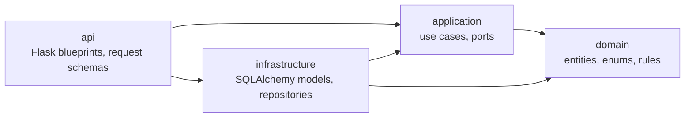
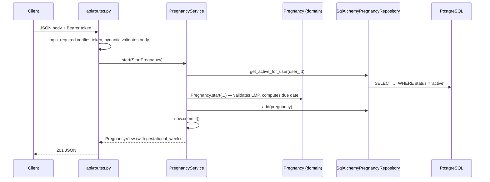

# Backend architecture

The backend is a **modular monolith** with **clean architecture** inside each module. It is one
Flask app and one PostgreSQL database, split into feature modules that follow the areas of the
product spec. Every module is layered, so business rules stay independent of Flask, SQLAlchemy and
HTTP.

- **Modular monolith:** one deployable is the right size for an MVP team. Module boundaries mean a
  module could later become a separate service without rewriting its core.
- **Clean architecture:** medical rules (due dates, red alerts, access to rehab exercises) are the
  most important code. They are plain Python, so they are easy to read and test, and changing the
  web framework or database layer doesn't touch them.

## Layout

```text
backend/
├── app/
│   ├── __init__.py            # create_app(): composition root
│   ├── config.py
│   ├── extensions.py          # db, migrate
│   ├── shared/                # shared kernel, used by every module
│   │   ├── domain/            #   errors (ValidationError, NotFoundError, …)
│   │   ├── application/       #   UnitOfWork port
│   │   ├── infrastructure/    #   ORM mixins and enum columns, SqlAlchemyUnitOfWork, access tokens
│   │   └── api/               #   JSON error handlers, login_required / roles_required
│   └── modules/
│       ├── identity/          # §1     users, OTP codes, sessions
│       ├── profiles/          # §2–3   demographic profile, medical history
│       ├── pregnancy/         # §4     pregnancy path (reference module, all four layers)
│       ├── monitoring/        # §5     daily logs
│       ├── documents/         # §6     medical documents
│       ├── care_team/         # §7     risk tags, staff notes, approvals
│       ├── audit/             # §8     audit log
│       ├── fitness/           # §9     fitness path
│       └── rehabilitation/    # §10–11 rehab profile and access control
├── migrations/                # Alembic
├── scripts/generate_erd.py    # regenerates docs/erd.svg
└── tests/
    ├── test_architecture.py   # enforces the dependency rules below
    └── modules/<module>/…     # tests mirror the module layout
```

A complete module has four layers. `pregnancy` is the reference implementation:

```text
modules/pregnancy/
├── domain/
│   ├── enums.py          # ConceptionType, PregnancyStatus, …
│   └── entities.py       # Pregnancy entity: start(), gestational_week(), end()
├── application/
│   ├── ports.py          # PregnancyRepository (Protocol)
│   └── services.py       # PregnancyService use cases, StartPregnancy command, PregnancyView
├── infrastructure/
│   ├── models.py         # PregnancyModel (SQLAlchemy table)
│   └── repository.py     # SqlAlchemyPregnancyRepository implements the port
└── api/
    ├── schemas.py        # request bodies (pydantic)
    └── routes.py         # Flask blueprint /api/v1/pregnancies
```

The other modules have their `domain` and `infrastructure` layers so far. They get `application`
and `api` layers as their endpoints are built.

## The dependency rule

Dependencies only point inwards. The inner layers know nothing about the outer ones.



| Layer | May import | Must not import |
|---|---|---|
| `domain` | the standard library, `shared.domain` | Flask, SQLAlchemy, pydantic, `application`, `infrastructure`, `api` |
| `application` | `domain`, `shared.domain`, `shared.application` | Flask, SQLAlchemy, pydantic, `infrastructure`, `api` |
| `infrastructure` | `domain`, `application`, SQLAlchemy, `app.extensions` | Flask, pydantic, `api` |
| `api` | everything in its own module | business rules (it only parses, calls a use case and serialises) |

Between modules, a module may use only another module's `domain` and `application` layers. For
example, rehabilitation can ask care_team "does this patient have an active rehab approval?"
through a care_team use case, but it never queries care_team's tables directly. Foreign keys
between modules are declared by table name (`ForeignKey("users.id")`), and ORM `relationship()`
links are only used inside a module.

`shared/` never imports a feature module.

`tests/test_architecture.py` checks all of these rules on every test run, so a wrong import fails
CI instead of slipping into review.

## How a request flows

`POST /api/v1/pregnancies`:



Errors are raised as domain exceptions (`ValidationError`, `ConflictError`, `NotFoundError`, …) and
turned into JSON by `shared/api/errors.py`:

```json
{"error": {"code": "conflict", "message": "You already have an active pregnancy.", "details": {}}}
```

| Exception | HTTP status |
|---|---|
| `ValidationError` (domain rule) or an invalid request body | 422 |
| `NotFoundError` | 404 |
| `ConflictError` | 409 |
| `AuthenticationError` | 401 |
| `PermissionDeniedError` | 403 |

## Authentication

`shared/infrastructure/tokens.py` issues and verifies signed, expiring access tokens (`itsdangerous`,
lifetime set by `ACCESS_TOKEN_TTL_SECONDS`). `login_required` and `roles_required("doctor", …)`
in `shared/api/auth.py` protect routes and expose `current_user()`. The identity module will issue
tokens after OTP verification. That flow is the next piece to build.

## Testing by layer

| Layer | How it is tested | Example |
|---|---|---|
| domain | plain unit tests, no database | `tests/modules/pregnancy/test_domain.py` |
| application | use cases with in-memory fake repositories | `tests/modules/pregnancy/test_services.py` |
| infrastructure | against PostgreSQL, rolled back after each test | `tests/modules/pregnancy/test_repository.py` |
| api | Flask test client end to end | `tests/modules/pregnancy/test_api.py` |

## Adding a feature

1. Put the rules in `domain/` as entities, enums and pure functions. Raise `shared.domain.errors`
   for invalid input.
2. In `application/`, declare the ports you need (`Protocol` classes) in `ports.py` and write the use
   case in `services.py`. The service returns a view dataclass, never an ORM object.
3. In `infrastructure/`, add or change the SQLAlchemy model and implement the port in
   `repository.py`, converting between the ORM row and the domain entity.
4. In `api/`, add pydantic request schemas and a blueprint in `routes.py` that exposes `bp`.
   `app/modules/__init__.py` registers it automatically.
5. If the schema changed, run `flask db migrate -m "…"`, review the migration, then run
   `python scripts/generate_erd.py`.
6. Add tests for each layer you touched.

A new module also needs its name added to `MODULES` in `app/modules/__init__.py`.

## Redis

Nothing in Phase 1 needs Redis yet. When the identity module is built, Redis belongs in
`shared/infrastructure/` (or `identity/infrastructure/`) behind a port such as `RateLimiter`, for OTP
send limits, brute-force counters and revoked-session lookups. Use cases depend on the port, not on
Redis.
