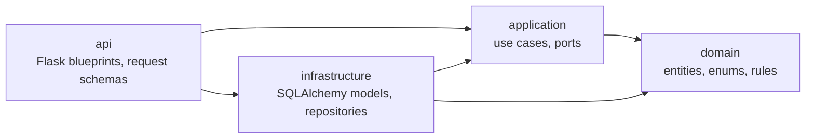
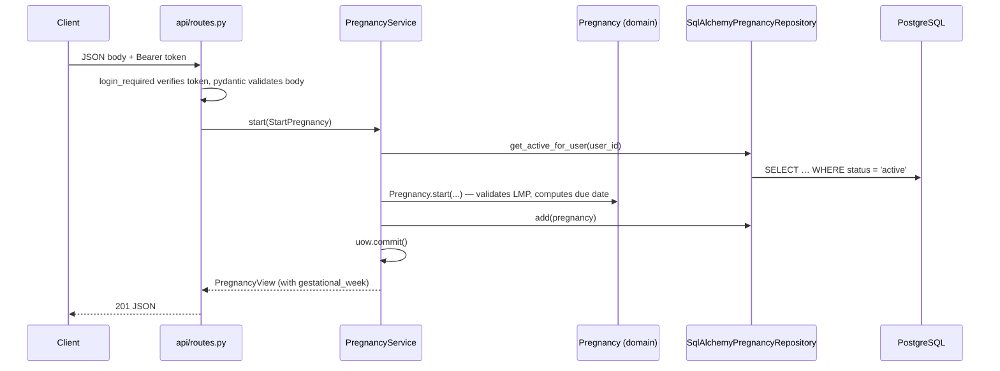

# Backend architecture

The backend is a **modular monolith** with **clean architecture** inside each module. It is one
Flask app and one PostgreSQL database, split into feature modules that follow the areas of the
product spec. Every module is layered, so business rules stay independent of Flask, SQLAlchemy and
HTTP.

- **Modular monolith:** one deployable is the right size for an MVP team. Module boundaries mean a
  module could later become a separate service without rewriting its core.
- **Clean architecture:** medical rules (due dates, red alerts, access to rehab exercises) are the
  most important code. They are plain Python, so they are easy to read and test, and changing the
  web framework or database layer doesn't touch them.

## Layout

```text
backend/
├── app/
│   ├── __init__.py            # create_app(): registers extensions, modules, error handlers
│   ├── wiring.py              # builds each use case with its concrete adapters
│   ├── cli.py                 # flask create-admin
│   ├── config.py
│   ├── extensions.py          # db, migrate
│   ├── shared/                # shared kernel, used by every module
│   │   ├── domain/            #   errors (ValidationError, NotFoundError, …), Jalali dates
│   │   ├── application/       #   UnitOfWork and PatientAccess ports, Actor / RequestContext
│   │   ├── infrastructure/    #   ORM mixins and enum columns, KeyedRepository, access tokens
│   │   └── api/               #   JSON error handlers, login_required / roles_required, body parsing
│   └── modules/
│       ├── identity/          # §1     users, OTP codes, sessions
│       ├── profiles/          # §2–3   demographic profile, medical history
│       ├── pregnancy/         # §4     pregnancy path, partner QR code (reference module)
│       ├── monitoring/        # §5     bleeding reports, the midwife's daily log
│       ├── documents/         # §6     medical documents (files stored in PostgreSQL)
│       ├── care_team/         # §7     staff, midwife choice, access, alerts, tags, notes, approvals
│       ├── audit/             # §8     audit log
│       ├── fitness/           # §9     fitness path
│       └── rehabilitation/    # §10–11 rehab profile and access control
├── migrations/                # Alembic
├── scripts/generate_erd.py    # regenerates docs/erd.svg
└── tests/
    ├── test_architecture.py   # enforces the dependency rules below
    └── modules/<module>/…     # tests mirror the module layout
```

A complete module has four layers. `pregnancy` is the reference implementation:

```text
modules/pregnancy/
├── domain/
│   ├── enums.py          # ConceptionType, PregnancyStatus, …
│   └── entities.py       # Pregnancy entity: start(), gestational_week(), end()
├── application/
│   ├── ports.py          # PregnancyRepository (Protocol)
│   └── services.py       # PregnancyService use cases, StartPregnancy command, PregnancyView
├── infrastructure/
│   ├── models.py         # PregnancyModel (SQLAlchemy table)
│   └── repository.py     # SqlAlchemyPregnancyRepository implements the port
└── api/
    ├── schemas.py        # request bodies (pydantic)
    └── routes.py         # Flask blueprint /api/v1/pregnancies
```

Every module now has all four layers (audit has no `api`: it is written to by the others).

## The dependency rule

Dependencies only point inwards. The inner layers know nothing about the outer ones.



| Layer | May import | Must not import |
|---|---|---|
| `domain` | the standard library, `shared.domain` | Flask, SQLAlchemy, pydantic, `application`, `infrastructure`, `api` |
| `application` | `domain`, `shared.domain`, `shared.application` | Flask, SQLAlchemy, pydantic, `infrastructure`, `api` |
| `infrastructure` | `domain`, `application`, SQLAlchemy, `app.extensions` | Flask, pydantic, `api` |
| `api` | everything in its own module | business rules (it only parses, calls a use case and serialises) |

Between modules, a module may use only another module's `domain` and `application` layers. For
example, rehabilitation can ask care_team "does this patient have an active rehab approval?"
through a care_team use case, but it never queries care_team's tables directly. Foreign keys
between modules are declared by table name (`ForeignKey("users.id")`), and ORM `relationship()`
links are only used inside a module.

One exception, for reads only: the staff panel's lists (patients, alerts, staff, notes) need names
and mobile numbers, so `care_team/infrastructure/repositories.py` joins `users` and `profiles` by
table name (`sa.table("users", …)`) instead of making one query per row. It never writes to them;
changes always go through the owning module.

Modules that need something from another module at run time receive it as a port or a plain
function from `app/wiring.py`. For example, monitoring gets `on_bleeding`, which raises a care team
alert in the same transaction, and every module that shows or changes a mother's record gets
`PatientAccess` (implemented by the care team) to check who may see her.

`shared/` never imports a feature module.

**Wiring.** Use cases receive their adapters (repositories, SMS sender, audit trail, token issuer)
through their constructor. `app/wiring.py` builds them for the current request. It's the one place
allowed to combine infrastructure from several modules, for example identity's repositories with
audit's trail. Module `api` layers import their service factory from there
(`from app.wiring import auth_service`); `domain`, `application` and `infrastructure` may not.

`tests/test_architecture.py` checks all of these rules on every test run, so a wrong import fails
CI instead of slipping into review.

## How a request flows

`POST /api/v1/pregnancies`:



Errors are raised as domain exceptions (`ValidationError`, `ConflictError`, `NotFoundError`, …) and
turned into JSON by `shared/api/errors.py`:

```json
{"error": {"code": "conflict", "message": "You already have an active pregnancy.", "details": {}}}
```

| Exception | HTTP status |
|---|---|
| `ValidationError` (domain rule) or an invalid request body | 422 |
| `NotFoundError` | 404 |
| `ConflictError` | 409 |
| `AuthenticationError` | 401 |
| `PermissionDeniedError` | 403 |
| `RateLimitedError` (with a `Retry-After` header) | 429 |
| `ServiceUnavailableError` (e.g. SMS gateway down) | 503 |

## Authentication

App users sign in with a one-time SMS code (identity module). Signing in with a new number creates
the account, so there is no separate sign-up.

| Step | Endpoint | Result |
|---|---|---|
| 1 | `POST /api/v1/auth/otp/request` `{mobile}` | 202; a 6-digit code is sent by SMS |
| 2 | `POST /api/v1/auth/otp/verify` `{mobile, code}` | access token (15 min), refresh token (30 days), `is_new_user` |
| 3 | `POST /api/v1/auth/token/refresh` `{refresh_token}` | new access and refresh tokens; the old refresh token stops working |
| 4 | `POST /api/v1/auth/logout` `{refresh_token}` | 204; the session is revoked |
| – | `GET /api/v1/me` | the signed-in account |

Protections:

- **Phone numbers** are accepted in any common format, including Persian digits, and stored as
  E.164 (`+989121234567`). The database only accepts Iranian mobiles in this form.
- **Codes** are stored only as an HMAC keyed with `SECRET_KEY`, expire after 2 minutes, work once,
  and lock after 5 wrong tries. Requesting a new code replaces the old one.
- **Sending limits:** one code per number per minute, 5 per number per hour and 20 per network per
  hour. Past a limit the API returns 429 with `Retry-After`.
- **The request-code response** is the same whether or not the number has an account.
- **Failed attempts** are committed before the error is returned, so they always count.
- **Audit log:** every successful and failed sign-in is written to `audit_logs`.
- **Refresh tokens** are stored only as a SHA-256 hash and replaced on every use.

**SMS.** `SMS_BACKEND` picks the `SmsSender` adapter (`identity/infrastructure/sms.py`):

| `SMS_BACKEND` | What happens |
|---|---|
| `kavenegar` | Sends the code with Kavenegar's Verify Lookup API, using the template named in `KAVENEGAR_OTP_TEMPLATE` (its text, with `%token`, is defined in the Kavenegar panel). Needs `KAVENEGAR_API_KEY`; the app refuses to start without it. Mothers and staff use the same template. |
| `console` | Development default: writes the code to the server log instead of sending it. |
| `memory` | Tests: keeps messages in a list. |

If Kavenegar rejects the message or can't be reached, the code is deleted (so it doesn't count
towards the sending limits) and the API returns 503 `service_unavailable`. The API key is part of
Kavenegar's URL, so the adapter never logs the URL.

`shared/infrastructure/tokens.py` signs and verifies access tokens (`itsdangerous`, lifetime set by
`ACCESS_TOKEN_TTL_SECONDS`). `login_required` and `roles_required("doctor", …)` in
`shared/api/auth.py` protect routes and expose `current_user()`. On every request `login_required`
also checks that the account still exists and is active (a check registered by the identity module
in `create_app`), so deactivating a user takes effect immediately rather than when the token
expires. Responses serialise dates as ISO 8601 (`shared/api/json.py`).

Not built yet: moving the rate-limit counters to Redis. Behind a
reverse proxy, also configure Werkzeug's `ProxyFix` so `request.remote_addr` is the client's IP.

## Phase 1 API

All paths start with `/api/v1` except the partner page. "Mother" is an app user (role `user`).

| Who | Endpoints |
|---|---|
| Anyone | `POST /auth/otp/request`, `/auth/otp/verify`, `/auth/token/refresh`, `/auth/logout` |
| Signed in | `GET /me` |
| Mother: onboarding | `GET/PUT /profile` (404 = new user; `home` says which screen to open), `GET/PUT /medical-history` |
| Mother: pregnancy | `POST /pregnancies`, `GET/PATCH /pregnancies/current` (PATCH corrects her LMP, cycle, conception or care provider), `POST /pregnancies/current/end`, `POST/GET /daily-logs` (bleeding only) |
| Mother: partner QR | `POST/GET/DELETE /partner-link` |
| Mother: midwife | `GET /midwives`, `GET/PUT /my-midwife` |
| Mother: other paths | `GET/PUT /fitness-profile`, `GET/PUT /rehab-profile` |
| Mother: documents | `GET /documents`, `GET /documents/<id>/file` |
| Spouse (no sign-in) | `GET /p/<token>` (Persian page), `GET /partner/<token>` (JSON) |
| Staff | `GET /staff/me` |
| Midwife and doctor | `GET /staff/patients?q=&page=&per_page=` (search by name, mobile or national code; 20 per page, at most 100), and under `/staff/patients/<id>`: `summary`, `record`, `daily-logs` (GET), `documents` (GET), `documents/<doc>/file`, `notes` (POST), `risk-tags` (POST, DELETE `/<tag>`), `fitness-profile/specialist-visit`, `rehab-profile/specialist-visit`, `pregnancy/due-date` (PUT, e.g. after an ultrasound) |
| Midwife only | `GET /staff/alerts`, `POST /staff/patients/<id>/daily-logs`, `POST /staff/patients/<id>/documents` (multipart), `DELETE /staff/patients/<id>/documents/<doc>` (optional `{"reason"}`), `PUT /staff/patients/<id>/rehab-profile/imaging` |
| Doctor only | `POST /staff/patients/<id>/approvals`, `DELETE /staff/patients/<id>/approvals/<scope>` |
| Admin | `POST/GET /admin/staff`, `PATCH /admin/staff/<id>`, `GET /admin/unassigned-alerts` |
| Midwife or admin | `POST /staff/alerts/<id>/seen` |

The first admin is created on the server with `flask create-admin 0912… --first-name … --last-name …`.

A Postman collection with every endpoint is in `docs/postman/` (see `scripts/generate_postman.py`).

### Who sees which mother

The rules are in `care_team/domain/policies.py` and are checked by `CareTeamService.require_record_access`.
A refusal returns 403 and is written to the audit log.

| Role | Can open a mother's record | Red alerts |
|---|---|---|
| Midwife | only mothers who chose her (`care_assignments`) | her mothers' alerts |
| Doctor | every mother while `DOCTOR_PATIENT_SCOPE=all` (Phase 1); only mothers who chose them once it is `assigned` (Phase 2) | none |
| Admin | none: admins manage accounts | alerts from mothers who haven't chosen a midwife yet |

`care_assignments` already has a `doctor` role, so Phase 2 only needs an endpoint for the mother to
choose her gynecologist and the setting changed to `assigned`. When an admin deactivates a midwife,
her assignments end, so her mothers' alerts go to the admins until they choose again.

## Testing by layer

| Layer | How it is tested | Example |
|---|---|---|
| domain | plain unit tests, no database | `tests/modules/pregnancy/test_domain.py` |
| application | use cases with in-memory fake repositories | `tests/modules/pregnancy/test_services.py` |
| infrastructure | against PostgreSQL, rolled back after each test | `tests/modules/pregnancy/test_repository.py` |
| api | Flask test client end to end | `tests/modules/pregnancy/test_api.py` |

## Adding a feature

1. Put the rules in `domain/` as entities, enums and pure functions. Raise `shared.domain.errors`
   for invalid input.
2. In `application/`, declare the ports you need (`Protocol` classes) in `ports.py` and write the use
   case in `services.py`. The service returns a view dataclass, never an ORM object.
3. In `infrastructure/`, add or change the SQLAlchemy model and implement the port in
   `repository.py`, converting between the ORM row and the domain entity.
4. In `api/`, add pydantic request schemas and a blueprint in `routes.py` that exposes `bp`.
   `app/modules/__init__.py` registers it automatically.
5. If the schema changed, run `flask db migrate -m "…"`, review the migration, then run
   `python scripts/generate_erd.py`.
6. Add tests for each layer you touched.

A new module also needs its name added to `MODULES` in `app/modules/__init__.py`.

## Redis

Nothing in Phase 1 needs Redis yet: OTP limits are counted from `otp_codes` in PostgreSQL. If load
grows, Redis belongs in `shared/infrastructure/` (or `identity/infrastructure/`) behind a port such
as `RateLimiter`, for OTP send limits, brute-force counters and revoked-session lookups. Use cases
depend on the port, not on Redis.
