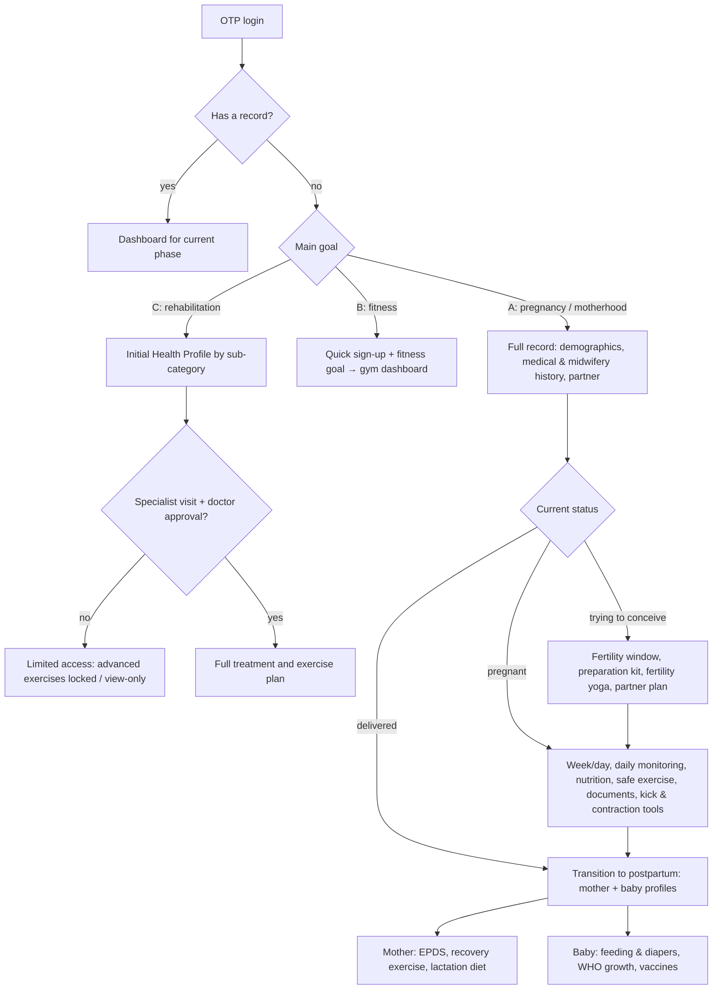

# Proposal review

A review of `proposal_maternal_health_platform.docx` ("پروپوزال طراحی و توسعه سامانه جامع سلامت مادر و
کودک، بارداری، بازتوانی، ورزش"), prepared by Roya Ghasemifar on 15 Tir 1405 (6 July 2026). It covers
what the project is, how it relates to the backend built so far, and what needs deciding before the
next phases.

## What the project is

**A digital layer for a physical maternal, family and wellness centre.** The centre offers:

- clinic visits (gynaecology, nutrition, psychology, sport medicine);
- a gym and yoga studio with private, semi-private, group and rooftop classes;
- a café and diet-meal service;
- massage;
- a companion midwife for labour;
- childcare (baby beds and a care and play room).

The product ties these together with a **lifelong health record** that follows a woman from
preconception, through pregnancy and birth, to postpartum and her baby's first years. It also
serves people who come only for fitness or rehabilitation.

It has three front ends:

| Front end | Used by | Main jobs |
|---|---|---|
| Mobile app | mothers, partners, fitness and rehab members | onboarding, health record, daily monitoring, nutrition, exercise, documents, tools, education, booking, payments |
| Care team web panel | doctors, midwives, nurses, psychologists, other specialists | summary card with red flags, full record, alerts, approvals, workout reports, safe discharge |
| Admin panel | centre staff | staff accounts, schedules, capacity, classes, services, packages, prices, content, permissions |

**Design principle (proposal §1):** "personalisation based on life phase and health status". What
the app shows, which features and bookings are allowed, and which alerts fire all depend on:

- the record;
- the user's phase;
- the symptoms she logs;
- whether a specialist has approved her.

The closing section calls the record a **decision engine**, not a static form. That's the heart of
the system: the backend is mostly a rules-and-permissions engine around a health record, with
booking and payments attached.

The document is also clear that the software **carries out clinically approved rules and does not
replace clinical judgement**. Every medical rule, piece of content and threshold must be signed off
by a doctor, midwife, nutritionist, psychologist or paediatrician before release.

## User journeys

## Scope by area

| Area | What the proposal asks for | Sections |
|---|---|---|
| Identity & onboarding | OTP login with countdown and resend, record check, goal choice, demographics, medical and midwifery history, **Partner Mode** (the partner scans a QR code and gets an observer dashboard with emergency alerts) | 4, 5-1, 5-3 – 5-5 |
| Preconception | LMP and cycle, fertility-window calendar, preparation kit, 30-day fertility yoga, partner nutrition and lifestyle plan, sex-selection diet | 5-7 |
| Pregnancy | how the pregnancy was detected, type, LMP or test date, week and day, due date, care provider, daily dashboard, fetus-size visuals, emergency triage chatbot | 5-8, 5-9 |
| Daily monitoring | about 15 symptoms, blood pressure, glucose (required for gestational diabetes), weight on a trimester schedule, mood, green/red feedback, smart ring and watch (heart rate, SpO₂) | 5-10 |
| Nutrition | daily meals, water, free-text feedback, free AI diet vs paid VIP specialist diet, café and meal reservations, caffeine lock in pregnancy | 5-11, 8 |
| Exercise | hidden safety triage before a workout, videos by pregnancy week, timer and hydration prompts, post-workout check that lowers the next day's intensity and notifies the midwife, paywall | 5-11 |
| Documents | photo/PDF upload with progress, test types (blood, urine, TSH, LH/FSH, NIPT, NST, ultrasound, breast imaging), fundal height, fetal heart rate, **OCR** of lab values with human confirmation | 5-12 |
| Late pregnancy | kick counter, contraction timer with a "go to hospital" alarm | 5-13 |
| Birth & postpartum | birth record (date, type, baby's length, weight and head size), preterm (< 37 weeks) mode, transition screen, EPDS, lactation diet with infant-allergy removal, recovery exercise locked until the 6-week check-up (caesarean: no abdominal work before week 6) | 5-14 – 5-18 |
| Baby | breastfeeding and bottle log, diapers (dehydration alert under 6 wet diapers in 24 h), WHO growth percentiles, vaccine passport, fever guidance, paediatric referral, AI jaundice screening from photos | 5-19 – 5-21, 5-15 |
| Education & events | "Academy" tab whose content follows the phase; classes for both parents; Smart Baby development programme; gym events | 6 |
| Care team panel | summary card (red flags in under 5 s), full record, alerts, approvals that unlock plans, safe discharge with a self-discharge waiver | 7 |
| Admin | staff accounts, profiles and credentials, working calendars and slots, class capacity with sold-out, package builder | 7-2, 7-4, 7-5 |
| Booking & payments | yoga (5 class types), group therapy, massage (locked in pregnancy), specialists, companion midwife, baby bed and play room; monthly (12-session) and seasonal (36-session) packages; full online payment; wallet; refunds up to X hours before (X set by admin) | 8, 9 |
| Safety rules | 14 named rules (T-01 to T-14); an auditable rule engine with condition, outcome, severity, event log and escalation for each rule; versioned rules | 10 |
| Platform | feature flags by phase, notifications (push, SMS, emergency), object storage, OCR, IoT, AI gateway, rule engine, transaction ledger, analytics | 11 |
| Privacy & security | data minimisation, role-based access (including partner/observer), audit trail, encryption in transit and at rest, consent records, file lifecycle, AI disclaimers | 12 |

## Delivery phases, and where the backend is today

| Proposal phase | Deliverables | Backend status |
|---|---|---|
| 1. Analysis & UX | journeys, information architecture, wireframes, design system, **rule matrix** | not started; the rule matrix is the most important input for the backend |
| 2. Identity & record | OTP, sign-up, basic record, history, **Partner Mode** | tables exist; OTP flow and Partner Mode not built |
| 3. Pregnancy & rehab paths | Initial Health Profile, pregnancy phases, daily dashboard, locks | pregnancy module has an API; rehab lock policy exists; others have tables only |
| 4. Care team | doctor/midwife panel, summary card, approvals, reports | tables for tags, notes and approvals; no API |
| 5. Booking & monetisation | booking, capacity, packages, wallet, payments, refunds | not started |
| 6. Postpartum & baby | mother/baby tabs, trackers, WHO, vaccines | not started |
| 7. AI / IoT / OCR | personalisation, OCR, wearables, triage | not started |
| 8. QA & launch | testing, security, UAT, training, monitoring | ongoing (tests, architecture checks) |

The "Phase 1 (MVP)" data-model document (`دیتامدل فاز 1 .docx`) roughly covers proposal
phases 2 and 3 plus the basic parts of phase 4. The two documents number their phases differently,
so the team should agree on one numbering.

## What this means for the current backend

The current modules and layering fit the proposal well. The rule engine, alerts, booking and
payments become new modules in the same structure. A few things in the Phase 1 model should change
**before** the endpoints are built on top of them.

### Changes to the Phase 1 model

| # | Change | Why (proposal section) |
|---|---|---|
| 1 | Add roles `nurse`, `psychologist`, `partner`, plus a `staff_profiles` table (specialty, bio, credentials shown when booking) | roles listed in §11–12; staff profiles in §7-5; nurses record weight and see preterm babies (§5-10, §5-14) |
| 2 | Password login (with a second factor) for staff; OTP stays for app users | §7-5: each clinician signs in with their own username and password |
| 3 | Partner Mode: `partner_links` (mother, partner user, status, scopes, created from a QR invite, revocable) and a `consents` table | §5-4, §12, acceptance criterion "partner access must be limited, revocable and consent-based" |
| 4 | Medical history: lifestyle flags (smoking, alcohol, fertility-harming medication), spouse infectious disease | §5-5 |
| 5 | Pregnancy: detection method (blood test, home test, missed period), test date as an alternative to LMP, care provider "none", number of fetuses, gestational diabetes | §5-8, §5-10; twins need per-fetus heart rate and several baby records |
| 6 | Daily log: add severe nausea, dizziness, abnormal swelling, vomiting, vaginal discharge, perceived poor fetal growth, and mood (sad, neutral or happy, with a reason) | §5-10 |
| 7 | **Replace the generated `is_red_alert` column with an `alerts` table written by the rule engine** (patient, rule id, rule version, severity, cause, status, who was notified, acknowledged by) | T-03 and T-06 depend on history and 48-hour windows, which one row can't express; §14 requires every red alert to be logged with its time, cause and notification target |
| 8 | Risk tags: add `breast_cyst`; add a `source` (system or staff) and make `added_by_id` optional, because most tags are derived automatically from the record | §7-1: blood type gives the RhoGAM tag; history gives cyst and thyroid tags; obstetric history gives the miscarriage tag |
| 9 | Documents: add hormone (LH/FSH), NIPT, NST and breast-imaging types; soft delete and versioning; limits on file type and size | §5-12, §12, §14 |
| 10 | A clear "current phase" for each user, with a transition use case (trying → pregnant → postpartum) that keeps history | §4; §14 "the phase change must not lose data" |

### The rule engine

The proposal asks for an auditable decision service in which each rule has a condition, outcome,
severity, event log and escalation, and rules are versioned. The simplest design that meets this
**and** the testing requirement (§14: every lock needs unit, integration and scenario tests) is
**rules as code**:

- A `safety` module whose `domain/rules/` holds one pure function per rule, named after the matrix
  (`T01_rehab_not_visited`, `T03_bleeding_or_high_bp_48h`, …), each with a version and severity.
- Use cases evaluate the relevant rules when data changes (a daily log is saved, a workout finishes,
  a birth is recorded). They write `alerts` and `locks`, tagged with the rule id and version, and
  send notifications.
- Clinicians approve rule changes as ordinary code reviews tied to the rule matrix. The audit log
  records which version fired.

A rule engine that admins can configure in the database isn't worth the risk for clinical rules:
it's harder to test and easier to misconfigure. Admin-tunable values (refund hours, class capacity)
belong in settings, not in rules.

### New modules for later phases

`safety` (rules, alerts, locks) · `notifications` (push, SMS, emergency; delivery log) · `partners` ·
`staff` (profiles, calendars) · `scheduling` (slots, capacity) · `booking` · `catalog` (services,
packages, entitlements) · `payments` (double-entry ledger, wallet, refunds) · `content` (academy,
videos, paywall) · `nutrition` · `exercise` · `postpartum` (birth record, recovery, EPDS) · `baby`
(feeding, diapers, growth, vaccines) · `integrations` (OCR, wearables, AI gateway).

Two technical points come straight from the acceptance criteria:

- **Capacity must never be oversold** (§14): take bookings in a transaction with row locks
  (`SELECT … FOR UPDATE`) or an atomic counter protected by a database CHECK constraint.
- **Money needs a reconcilable ledger** (§14): use an append-only double-entry ledger. Wallet
  balances are derived from the ledger, never stored as a single editable number.

## Problems in the document

1. **The same letters mean two different things.** "Path A/B/C" is used for the goal options
   (pregnancy / fitness / rehab, §5-1) and for the pregnancy sub-paths (trying / pregnant /
   delivered, §5-7, §5-8, §5-14). §8-1 "users on path B" then describes pregnancy content, while
   §8-2 describes fitness members. Give every path a unique name.
2. **Cross-references point to a numbering that isn't in the document.** Examples:
   - "step 3", "step 7", "step 11" and "step 12" (§5-11, §5-18);
   - "section 19" for the education tab, which is actually §6 (§5-9);
   - "DOC-03" (§7-1);
   - "steps 1 to 20, numbers 22 to 24" (§15; item 21 is missing).

   These seem to refer to the client's original brief. The table of contents doesn't match the body
   either (sections 6 and 15).
3. **Blood pressure is unresolved.** §5-10 asks for daily BP logging but quotes the client: "she
   shouldn't measure it herself, she must go to the doctor". The Phase 1 data-model document says
   the midwife records it. This needs a clinical decision.
4. **Weight recording.** §5-10 gives this to the nurse; the Phase 1 data-model document gives it to
   the midwife.
5. **Rehab depends on booking, which comes later.** T-01 and T-02 require the rehab user to book a
   visit (§5-2), but booking is proposal phase 5, while rehab is phase 3. Until booking exists, staff
   have to mark the visit as done by hand (this is what `specialist_visit_completed` supports).
6. **Exercise requirements sit under nutrition.** The pre-workout triage, videos and paywall are in
   §5-11 (nutrition). Moving them to their own section would help.
7. **"Safe discharge" has no context.** §7-3 describes a midwife confirming fetal heart rate before
   "safe exit of mother and child", with a waiver if the mother leaves earlier. It doesn't say when
   this happens: after a class, after a clinic visit, or after labour support.

## Clinical, ethical and regulatory risks

- **AI jaundice screening from photos (§5-15)** estimates bilirubin and recommends phototherapy. That
  makes it software acting as a medical device, which normally needs regulatory approval from the
  Ministry of Health before use. The proposal notes this; it should be scheduled as a separate,
  gated project.
- **Sex-selection diet (§5-7)** has no reliable scientific evidence behind it and raises ethical
  concerns. Even with the proposed "limited, non-definitive" disclaimer, it could damage trust in
  the medical content. Consider dropping it.
- **Self-harm answers on the EPDS (§5-16).** An SMS to the partner or trusted person isn't an
  adequate crisis response on its own. It needs:
  - an on-call clinician path;
  - the emergency number shown in the app immediately;
  - explicit consent, given in advance, for sharing mental-health alerts with that person;
  - a validated Persian version of the EPDS with clinician-set cut-offs. A **weekly** mandatory
    EPDS may also cause fatigue, so the screening schedule should be a clinical decision.
- **The emergency triage chatbot (§5-9)** must never delay care. It should show "call the emergency
  number / go to hospital" first and be tested against clinical scenarios.
- **Dosing advice** (paracetamol drops by weight after vaccination, §5-21), **lactation calorie
  targets** (§5-17) and **contraction thresholds** (§5-13) are clinical protocols. They need
  sign-off and version control like the safety rules.
- **Wallet:** a stored-value wallet may carry payment and e-money regulatory obligations. Check
  these with the payment provider.

## Missing requirements

The proposal covers function in depth but says little about:

- **Scale and availability:** expected users and staff, one centre or several branches, uptime
  target, backup and recovery.
- **Locale:** Persian right-to-left UI, **Jalali calendar** in the app (the proposal itself is dated
  1405), and the Asia/Tehran time zone for "48 hours", "24 hours" and refund windows. The API
  should store UTC timestamps and ISO dates, and clients should convert to Jalali for display.
- **Data retention and deletion:** how long records and files are kept, what happens when an account
  is closed, and where the data is hosted.
- **Staff account security:** password policy, second factor, session timeout on the web panel.
- **Notifications:** which SMS and push providers, delivery guarantees and retries for emergency
  messages, quiet hours.
- **Success metrics:** apart from "red flags visible in under 5 seconds", there are no product or
  clinical KPIs.
- **Budget, timeline and team** for each phase.

## Questions for the product owner and clinical team

1. Is this for one centre or several branches?
2. Is the partner a full user account (Partner Mode) or only data in the mother's record? Can both
   partners be the "patient"?
3. Who records blood pressure and weight (patient, midwife or nurse), and can patients log
   readings from home devices?
4. When does "safe discharge" (§7-3) happen?
5. Should multiple pregnancies (twins or more) be supported from the start?
6. Which rules in the T-01 to T-14 matrix are in the first release, and who on the clinical team
   signs off each one?
7. Is the sex-selection diet staying in scope?
8. What is the EPDS schedule, and what is the escalation path for a positive self-harm answer?

## Suggested next steps

1. Agree on phase numbering and unique path names, and turn §10 into a **rule matrix** that
   clinicians sign off (rule id, condition, outcome, severity, escalation, owner).
2. Apply the Phase 1 model changes above in one migration, especially roles, staff login, partner
   links and consents, the pregnancy fields and the `alerts` table.
3. Build the identity module next (OTP for users, password + second factor for staff), because
   every other endpoint depends on it.
4. Add the `safety` module with the rules needed for the first release (T-01, T-02, T-03, T-06) and
   the alerts they create, with scenario tests.
